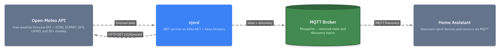

<p align="center">
  
</p>

<h1 align="center">njord</h1>

<p align="center">
  Multi-model weather forecasts in Home Assistant — powered by Open-Meteo
</p>

<p align="center">
  <a href="https://github.com/st0o0/njord/blob/main/LICENSE"></a>
  
  <a href="https://st0o0.github.io/njord/"></a>
</p>

---

A .NET service (Docker container) built on [Akka.NET](https://getakka.net/) + Akka.Streams that polls
the [Open-Meteo API](https://open-meteo.com/en/docs) for multiple weather models
per location and publishes everything as Home Assistant entities via
[MQTT Discovery](https://www.home-assistant.io/integrations/mqtt/#mqtt-discovery).

## Features

- **50+ weather models** — ICON, ECMWF, GFS, UKMO, MeteoSwiss, and regional models from Open-Meteo
- **Multiple locations** — configure as many locations as you need, each with its own model selection
- **Enrichment pipeline** — consensus forecasts, weather alerts, trends, derived values, energy management, and more
- **Auto-discovery** — devices and sensors appear in Home Assistant automatically via MQTT Discovery
- **Single container** — runs on any Docker host with SQLite persistence by default, no external database needed

## Architecture

<p align="center">
  
</p>

## Quick Start

```yaml
# docker-compose.yml
services:
  njord:
    image: ghcr.io/st0o0/njord:latest
    restart: unless-stopped
    volumes:
      - njord-data:/app/data
    environment:
      - Njord__Mqtt__Host=<your-mosquitto-host>
      - Njord__Locations__0__Name=home
      - Njord__Locations__0__Latitude=47.05
      - Njord__Locations__0__Longitude=8.31

volumes:
  njord-data:
```

```bash
docker compose up -d
```

After the first poll cycle (up to 60 minutes), check **Settings > Devices & Services > MQTT** in Home Assistant.

## Documentation

Full documentation is available at **[st0o0.github.io/njord](https://st0o0.github.io/njord/)** — including:

- [Getting Started](https://st0o0.github.io/njord/getting-started) — installation and minimal setup
- [Configuration](https://st0o0.github.io/njord/configuration/) — all available options
- [Model Catalog](https://st0o0.github.io/njord/models) — choosing the right weather models
- [Home Assistant](https://st0o0.github.io/njord/home-assistant) — entity naming, dashboards, automations
- [Architecture](https://st0o0.github.io/njord/architecture) — system design and data flow
- [Config Builder](https://st0o0.github.io/njord/builder) — interactive configuration generator

## Build & Test

All commands run from `src/`:

```powershell
dotnet build Njord.slnx
dotnet run --project Njord.Tests/Njord.Tests.csproj   # xUnit v3 via MTP
```

## License

[MIT](LICENSE) — weather data from [Open-Meteo](https://open-meteo.com/) is licensed under [CC BY 4.0](https://creativecommons.org/licenses/by/4.0/).
